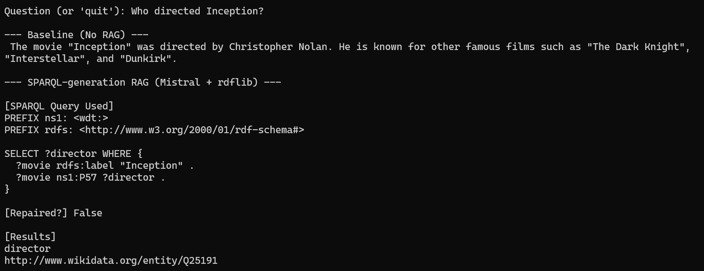
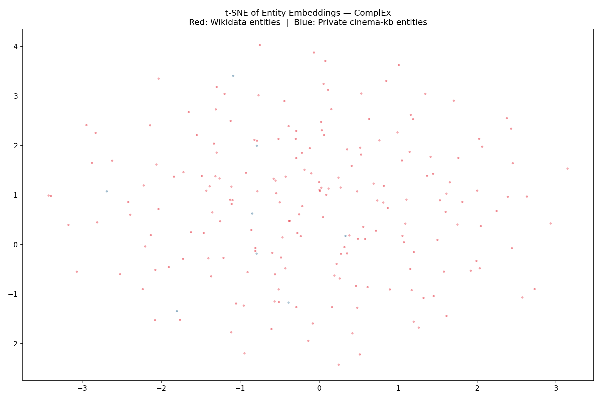

# 🎬 Cinema Knowledge Graph

An end-to-end pipeline to build, enrich, and query a domain-specific **Knowledge Graph** focused on cinema — from raw Wikipedia text all the way to a SPARQL-powered RAG system using a local LLM.

---

## 📁 Project Structure

```
cinema-knowledge-graph/
│
├── TD1_crawling/          # Web crawling & NLP relation extraction
├── TD4_kb_alignment/      # RDF modeling, Wikidata alignment & KB expansion
├── TD5_reasoning_kge/     # SWRL reasoning (OWLReady2) & KGE training (PyKEEN)
├── TD6_rag/               # SPARQL generation RAG system (Mistral + rdflib)
└── report/                # Final PDF report
```

---

## 🔧 Pipeline Overview

### TD1 — Web Crawling & Information Extraction
- Crawls 8 Wikipedia pages (4 directors, 4 films) using `httpx` + `trafilatura`
- Extracts named entities with `spaCy` (`en_core_web_trf`): PERSON, WORK OF ART, ORG, GPE, DATE
- Builds relational triples via dependency parsing (subject–verb–object)
- **Output:** `crawler_output.jsonl`, `extracted_knowledge.csv`

### TD4 — KB Construction & Wikidata Alignment
- Models extracted entities as RDF triples using `rdflib`
- Aligns entities to Wikidata via the Search API with confidence scoring (`owl:sameAs` for score ≥ 0.90)
- Expands the KB using predicate-controlled SPARQL queries restricted to films (`wd:Q11424`)
- **Output:** `private_kb.ttl`, `private_kb_aligned.ttl`, `expanded_kb.ttl` (99,106 triples)

### TD5 — Reasoning & Knowledge Graph Embeddings
- Validates SWRL rules on `family.owl` via OWLReady2 + Pellet reasoner
- Applies a cinema-domain Horn rule to infer `workedWith` relationships between co-directors
- Trains and compares **TransE** vs **ComplEx** using PyKEEN on the filtered KB (276 cinema triples)
- **Output:** `tsne_clustering.png`, train/test/valid splits, alignment CSV

| Model   | MRR    | Hits@1 | Hits@10 |
|---------|--------|--------|---------|
| TransE  | 0.1683 | 0.1250 | 0.1875  |
| ComplEx | 0.0156 | 0.0000 | 0.0000  |

### TD6 — SPARQL RAG with Local LLM
- Translates natural language questions into SPARQL 1.1 using **Mistral via Ollama**
- Dynamically injects a schema summary (P57, P161, P166...) into the prompt
- Includes a self-repair loop: catches `rdflib` parse errors and feeds the traceback back to the LLM
- Queries the local `expanded_kb_cleaned.ttl` graph
- **Output:** CLI demo (`td6.py`)

---

## ⚙️ Installation

```bash
pip install httpx trafilatura spacy rdflib requests pykeen owlready2
python -m spacy download en_core_web_trf
```

For the RAG system, you also need [Ollama](https://ollama.com) running locally with Mistral:

```bash
ollama pull mistral
ollama serve
```

---

## 🖥️ Hardware Requirements

| Component | Minimum | Recommended |
|-----------|---------|-------------|
| RAM | 8 GB | 16 GB |
| GPU | None (CPU fallback) | CUDA-compatible GPU (for PyKEEN) |
| Disk space | ~2 GB | ~5 GB (for full expanded KB) |
| OS | Windows / Linux / macOS | Linux / macOS |

> **Note:** The KGE training step (`TD5`) will run significantly faster with a CUDA GPU. The RAG demo (`TD6`) runs Mistral locally via Ollama, which requires at least 8 GB of RAM and benefits from a GPU for acceptable inference speed.

---

## 🚀 How to Run Each Module

### TD1 — Crawling
```bash
cd TD1_crawling
jupyter notebook td1.ipynb
```

### TD4 — KB Alignment
```bash
cd TD4_kb_alignment
jupyter notebook td4.ipynb
```

### TD5 — Reasoning & KGE
```bash
cd TD5_reasoning_kge
jupyter notebook td5_WebDatamining.ipynb
```

### TD6 — RAG Demo
```bash
cd TD6_rag
python td6.py
```

You will be prompted to type natural language questions such as:
- *Who directed Inception?*
- *Which films did Christopher Nolan direct?*
- *Who are the cast members of The Godfather?*

The system prints both the baseline LLM answer and the SPARQL-generated result from the local graph.

---

## 📸 Screenshots

### RAG CLI Demo — Question: "Who directed Inception?"


### t-SNE Projection of TransE Embeddings


---

## 📊 Key Results

- **Corpus size:** 141,442 words across 8 Wikipedia pages
- **Entities extracted:** 11,509 (NER)
- **KB alignment rate:** 71.1% (4,403 / 6,194 entities linked to Wikidata)
- **Final KB size:** 99,106 triples, 66,864 entities
- **Best KGE model:** TransE (MRR: 0.1683)
- **RAG success rate:** 1/5 fully correct (Q1), 3/5 syntactically valid but semantically incorrect, 1/5 syntax crash with partial self-repair

---

## 📄 Report

The full written report is available in [`report/final_report_WebDatamining.pdf`](./report/final_report_WebDatamining.pdf).

---

## 🗂️ Technologies

`Python` · `spaCy` · `rdflib` · `Wikidata API` · `OWLReady2` · `Pellet` · `PyKEEN` · `Mistral` · `Ollama` · `SPARQL 1.1` · `Turtle / N-Triples`
